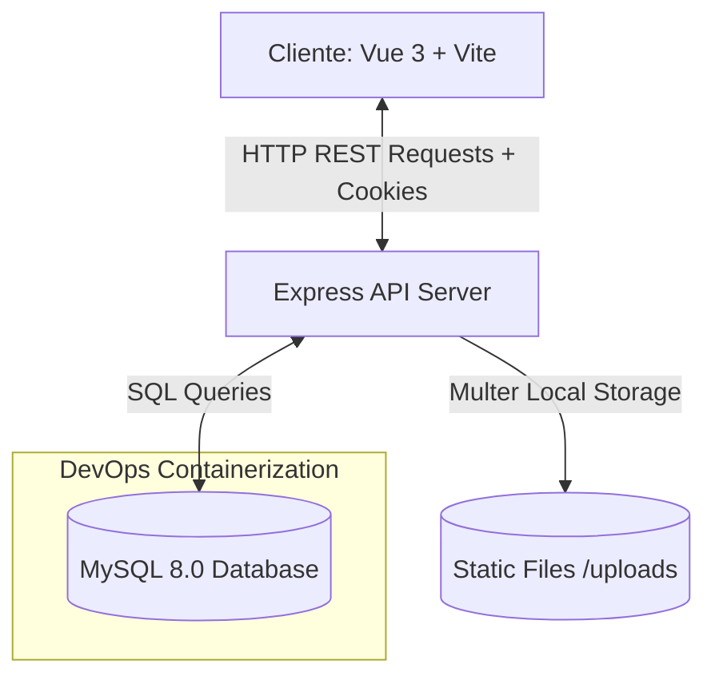
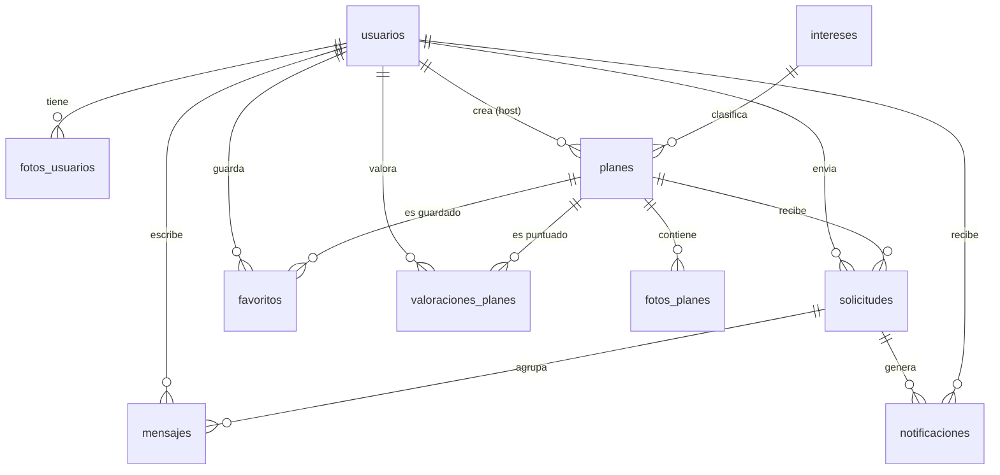

# Dossier Técnico de Arquitectura y Diseño - Link&Plan (TFG)

Este documento es una especificación técnica de nivel profesional del proyecto de Trabajo de Fin de Grado (TFG) **Link&Plan** (Web de Citas y Actividades Sociales). Diseñado para proporcionar el contexto estructural e ingenieril completo a tutores, tribunales académicos o modelos de lenguaje asistentes (LLMs) para co-desarrollar e implementar ampliaciones de forma coordinada.

---

## 1. Arquitectura y Justificación Tecnológica

La aplicación se ha desarrollado bajo un modelo de arquitectura **Cliente-Servidor desacoplado** que separa claramente la interfaz de usuario de la lógica de negocio y persistencia de datos.



### Justificación del Stack Tecnológico
1. **Frontend: Vue 3 (Composition API) + Vite + Pinia**
   * **Vue 3**: Ofrece reactividad de alto rendimiento con el nuevo motor de compilación y una estructura modular limpia vía `<script setup>`.
   * **Vite**: Elegido como empaquetador moderno debido a su velocidad de compilación casi instantánea (Hot Module Replacement instantáneo) en comparación con Webpack tradicional.
   * **Pinia**: Adoptado como el gestor de estado centralizado oficial para Vue 3. Es extremadamente ligero, tipado de forma nativa y elimina el exceso de boilerplate (mutaciones) de Vuex.
   * **Leaflet + MarkerCluster**: Se ha integrado esta biblioteca de mapas de código abierto en lugar de Google Maps API debido a:
     * Cero costes de licencia/API Keys.
     * Completa privacidad y control de datos geográficos.
     * Alta velocidad de renderizado para clusters de marcadores de actividades locales.

2. **Backend: Node.js + Express.js (ES Modules)**
   * **Express.js (v5.x)**: El estándar de facto en Node.js, configurado nativamente con módulos ES (`import/export`) para código moderno y modular. Su naturaleza asíncrona y no bloqueante optimiza el manejo de múltiples conexiones simultáneas de usuarios buscando planes.

3. **Base de Datos: Relacional (MySQL 8.0)**
   * **Justificación Relacional frente a NoSQL**: El núcleo del negocio exige consistencia referencial estricta, consultas complejas (JOINs) y relaciones transitivas bien estructuradas (ej: un plan pertenece a un usuario, una solicitud une a un usuario con un plan, los mensajes dependen de una solicitud aceptada). Una base de datos relacional asegura la **integridad referencial en cascada** y facilita análisis geográficos directos mediante fórmulas trigonométricas de distancias (Fórmula de Haversine), algo muy ineficiente y propenso a inconsistencias en bases de datos orientadas a documentos como MongoDB.

---

## 2. Estructura de Directorios del Proyecto

El código está organizado de manera intuitiva y estructurada siguiendo patrones de desarrollo limpio:

```text
Web_citas/
├── docker-compose.yaml             # Orquestación del servicio MySQL de desarrollo
├── backend/
│   ├── package.json                # Dependencias (Express, Multer, Bcrypt, JWT, MySQL2)
│   ├── uploads/                    # Almacenamiento local de fotos de perfiles y planes
│   └── database/
│       ├── init.sql                # Definición del esquema DDL
│       └── seeder.sql              # Poblado con datos iniciales realistas para pruebas
│   └── api/
│       ├── app.js                  # Punto de entrada y middleware de Express
│       ├── config/
│       │   └── db.js               # Conexión pool y configuración de MySQL
│       ├── controllers/            # Controladores de la API (Petición/Respuesta)
│       ├── middlewares/            # Middlewares (Autenticación, errores, cargas)
│       ├── models/                 # Modelos de datos (Consultas SQL crudas y parametrizadas)
│       └── routes/                 # Enrutadores RESTful divididos por dominios
└── frontend/
    ├── index.html                  # Plantilla HTML principal
    ├── vite.config.js              # Configuración de empaquetado de Vite
    ├── package.json                # Dependencias (Vue 3, Pinia, Router, Leaflet, Axios)
    └── src/
        ├── main.js                 # Inicialización de la SPA de Vue
        ├── App.vue                 # Contenedor raíz de la interfaz
        ├── assets/                 # Estilos globales y recursos estáticos
        ├── routes/
        │   └── routes.js           # Enrutamiento de la SPA y Guardias de Navegación
        ├── stores/                 # Estados centralizados de Pinia (auth, planes, notificaciones)
        ├── components/             # Componentes modulares y reutilizables (NavBar, PlanCard, etc.)
        └── views/                  # Páginas/Vistas principales de la aplicación
```

---

## 3. Modelo de Datos y Esquema Relacional

El esquema de base de datos se compone de 10 tablas altamente normalizadas que garantizan la integridad referencial y facilitan operaciones complejas en cascada:



### Tabla de Entidades y Atributos Clave

1. **`usuarios`**: Registra las credenciales, datos biográficos, ubicación geográfica actual (`lat`, `lng`) y preferencias de género/orientación del usuario.
2. **`intereses`**: Tabla maestra que contiene 50 intereses clasificados en categorías (*Deporte, Gastronomía, Cultura, Ocio, Lifestyle, Fiesta*), permitiendo clasificar los planes de forma estricta.
3. **`planes`**: Almacena las actividades propuestas por un host (usuario), asociando un interés obligatorio, capacidad máxima (`max_asistentes`), ubicación del evento y fecha programada.
4. **`solicitudes`**: Tabla pivot que modela la intención de un usuario de unirse a un plan de otro. Estado gestionado mediante un ENUM (`pendiente`, `aceptada`, `rechazada`).
5. **`mensajes`**: Contiene la conversación ligada a una solicitud. Permite chat dinámico directo o grupal.
6. **`notificaciones`**: Registra eventos clave en el ciclo de vida de una solicitud para alertar al solicitante o al host.
7. **`favoritos`**: Permite a los usuarios guardar planes de interés en sus paneles.
8. **`valoraciones_planes`**: Almacena reseñas numéricas (1 a 5 estrellas) y comentarios de asistentes una vez concluido el evento.

> [!IMPORTANT]
> **Integridad Referencial Extrema**: Casi todas las claves foráneas tienen políticas `ON DELETE CASCADE`. Si un usuario elimina su cuenta, se destruyen automáticamente sus planes, solicitudes, fotos, mensajes y valoraciones, cumpliendo estrictamente con normativas de protección de datos (como el RGPD).

---

## 4. Buenas Prácticas del Mundo Real y Seguridad

Este proyecto destaca por implementar patrones de producción real, superando el nivel habitual de un desarrollo académico local:

### A. Seguridad de Sesión: JWT en HttpOnly Cookies
En lugar de almacenar tokens JWT en el `localStorage` (altamente vulnerable a ataques XSS mediante inyección de scripts que roban tokens), **Link&Plan** implementa el flujo recomendado por OWASP:
* Al hacer login correcto, el servidor genera el token JWT y lo inyecta en una cookie cifrada llamada `galeta` con las propiedades `{ httpOnly: true, maxAge: 3600000 }`.
* El flag `httpOnly` indica al navegador que el script del lado cliente no puede leer ni modificar la cookie bajo ningún concepto. El navegador la adjunta de forma automática en cada petición subsiguiente dirigida al backend (`withCredentials: true`), previniendo robos de identidad por inyección de scripts.

### B. Guardia de Navegación del Lado Cliente
En Vue Router, todas las páginas protegidas (`meta: { requiresAuth: true }`) ejecutan una verificación activa en el backend antes de permitir el renderizado de la página mediante una función interceptora:
```javascript
router.beforeEach(async (to) => {
  if (!to.meta.requiresAuth) return true;
  try {
    await axios.get('http://localhost:3000/api/verificar-sesion', { withCredentials: true });
    return true;
  } catch (error) {
    return { path: "/login", query: { next: to.fullPath } };
  }
});
```

### C. Hashing de Contraseñas
Las contraseñas no se almacenan nunca en texto plano. Se procesan usando el algoritmo criptográfico adaptativo **Bcrypt** con un factor de coste (*salt rounds*) de `10`. Esto ralentiza significativamente los ataques de fuerza bruta y diccionario.

### D. Seguridad en la Carga de Archivos (Multer)
El middleware de subida de imágenes (`uploadMiddleware.js`) valida de forma rigurosa:
1. **Límite de tamaño**: Restringe los archivos a un máximo de `10 MB` para evitar ataques de denegación de servicio por saturación de disco.
2. **Filtro de extensiones y Mime-Type**: Valida que tanto la extensión del archivo como su Mime-Type real coincidan estrictamente con formatos gráficos (`jpeg|jpg|png|gif|webp`). Esto previene la inyección y posterior ejecución de scripts del lado servidor (como un archivo `.php` o `.js` disfrazado de imagen).

### E. Lógica de Cupos de Asistencia
La aplicación define de forma muy ingeniosa el número de personas permitidas en cada plan. Al crear la solicitud, se calcula dinámicamente el cupo:
$$\text{plazasDisponibles} = \max(0, \text{max\_asistentes} - 1)$$
Se resta `1` porque el creador del plan (host) ya ocupa una plaza física en el evento. Si la cantidad de solicitudes en estado `aceptada` es igual o mayor a `plazasDisponibles`, el plan rechaza automáticamente solicitudes nuevas con un código HTTP `409 Conflict`.

---

## 5. Algoritmo Inteligente de Enrutamiento de Chats (SQL)

Una de las joyas arquitectónicas del backend es la consulta SQL que gestiona las conversaciones activas (`getConversaciones` en `mensajesModel.js`). El sistema no requiere crear salas de chat fijas, sino que **las deduce dinámicamente de la base de datos** según el número de personas aceptadas en un plan:

1. **Conversación Directa (1 a 1)**: Si un plan tiene **exactamente 1** solicitud aceptada, el sistema lo enruta como chat privado directo.
2. **Conversación Grupal (Multiusuario)**: Si un plan llega a **2 o más** solicitudes aceptadas, el sistema unifica automáticamente el chat en un grupo, agregando los nombres de todos los participantes y compartiendo los mensajes entre el host y todos los invitados.

Esta deducción dinámica mediante una expresión de tabla común (`WITH` en MySQL 8) evita duplicar datos en tablas complejas y garantiza una sincronización instantánea:

```sql
WITH accepted_counts AS (
  SELECT s.id_plan, COUNT(*) AS accepted_count
  FROM solicitudes s
  WHERE s.estado = 'aceptada'
  GROUP BY s.id_plan
),
direct_conversations AS (
  -- Deduce chats 1-a-1 si accepted_count = 1
  ...
),
group_conversations AS (
  -- Deduce chats de grupo si accepted_count >= 2
  ...
)
```

---

## 6. Blueprint Completo de Endpoints de la API REST

A continuación se detallan los 19 endpoints implementados en el backend Express:

### Autenticación y Perfil (`/api/*`)

| Método | Endpoint | Protegido | Descripción | Datos Entrada / Body |
| :--- | :--- | :---: | :--- | :--- |
| **POST** | `/api/register` | No | Registra un nuevo usuario con contraseña cifrada. | `{ nombre, email, edad, contrasena, genero, orientacion }` |
| **POST** | `/api/login` | No | Autentica al usuario y guarda el JWT en HttpOnly Cookie. | `{ email, contrasena }` |
| **POST** | `/api/logout` | Sí | Borra la cookie de sesión del navegador. | Ninguno |
| **GET** | `/api/verificar-sesion` | Sí | Verifica la validez del token en la cookie `galeta`. | Ninguno (Lee cookie) |
| **PUT** | `/api/actualizarubicacion` | Sí | Actualiza la dirección y coordenadas GPS del usuario. | `{ direccion, longitud, latitud }` |
| **GET** | `/api/perfil` | Sí | Devuelve el perfil completo del usuario autenticado + estadísticas. | Ninguno |
| **GET** | `/api/perfil/:id` | Sí | Devuelve el perfil público de otro usuario específico. | ID en URL |
| **GET** | `/api/perfil/:id/planes` | Sí | Lista todos los planes organizados (hosted) por ese usuario. | ID en URL |
| **POST** | `/api/perfil/foto` | Sí | Sube y adjunta una nueva foto al perfil (Multer). | `multipart/form-data` con campo `foto` |
| **PUT** | `/api/perfil/foto-principal` | Sí | Actualiza o establece la imagen principal del perfil. | `multipart/form-data` con campo `foto` |
| **PUT** | `/api/perfil/descripcion` | Sí | Actualiza el campo biográfico de texto del usuario. | `{ descripcion }` |

### Gestión de Planes e Intereses (`/api/*`)

| Método | Endpoint | Protegido | Descripción | Parámetros de Consulta / Body |
| :--- | :--- | :---: | :--- | :--- |
| **GET** | `/api/planes` | Sí | Filtra planes de otros por geolocalización, orientación y fechas. | Query: `orientacion`, `modalidad`, `radio`, `lat`, `lng`, `fecha_desde`, `fecha_hasta` |
| **GET** | `/api/planes/mis-planes` | Sí | Lista planes creados por el usuario y aquellos en los que participa. | Ninguno |
| **GET** | `/api/planes/:id` | No | Devuelve los detalles completos de un plan específico. | ID en URL |
| **POST** | `/api/planes` | Sí | Crea un plan asociando coordenadas, descripción y hasta 5 fotos. | `multipart/form-data` con campos de datos + array `fotos` |
| **GET** | `/api/intereses` | No | Lista los 50 intereses ordenados por categoría para desplegables. | Ninguno |
| **GET** | `/api/planes/:id/valoracion` | Sí | Comprueba si el usuario puede valorar el plan y saca estadísticas. | ID en URL |
| **POST** | `/api/planes/:id/valoracion` | Sí | Inserta o actualiza la puntuación del plan (1-5 estrellas) y comentario. | `{ puntuacion, comentario }` |

### Solicitudes, Mensajes y Favoritos (`/api/*`)

| Método | Endpoint | Protegido | Descripción | Datos Entrada / Body |
| :--- | :--- | :---: | :--- | :--- |
| **POST** | `/api/solicitudes` | Sí | Envía una petición para unirse a un plan de un tercero. | `{ id_plan, mensaje }` |
| **GET** | `/api/solicitudes/mis-solicitudes`| Sí | Obtiene las solicitudes recibidas en los planes propios del usuario. | Ninguno |
| **GET** | `/api/solicitudes/plan/:id_plan`| Sí | Obtiene las solicitudes pendientes para un plan específico propio. | ID en URL |
| **PUT** | `/api/solicitudes/:id` | Sí | Acepta o rechaza una solicitud pendiente. Lanza notificaciones. | `{ estado }` (valores: `'aceptada'`, `'rechazada'`) |
| **GET** | `/api/notificaciones` | Sí | Devuelve el histórico de notificaciones del usuario autenticado. | Ninguno |
| **GET** | `/api/favoritos` | Sí | Obtiene todos los planes marcados como favoritos del usuario. | Ninguno |
| **POST** | `/api/planes/:id/favorito` | Sí | Realiza el toggle (añadir/quitar) de favorito sobre un plan. | ID en URL |
| **GET** | `/api/mensajes/conversaciones`| Sí | Lista los chats activos (1-a-1 y grupales) ordenados por último mensaje.| Ninguno |
| **GET** | `/api/mensajes/:chat_key` | Sí | Devuelve los mensajes de una conversación (`chat_key`: direct-ID o group-ID).| `chat_key` en URL |
| **POST** | `/api/mensajes` | Sí | Envía un mensaje a un chat indicando la solicitud de referencia. | `{ id_solicitud, mensaje }` |

---

## 8. Despliegue, DevOps y Réplica de Entornos

Para cumplir de forma sobresaliente con el pilar de **Buenas Prácticas DevOps**, el entorno local de base de datos se encuentra completamente encapsulado en **Docker**.

### A. Docker Compose
El archivo `docker-compose.yaml` en la raíz define el motor de base de datos MySQL 8.0, exponiendo el puerto estándar `3306` y configurando variables de entorno necesarias para la auto-inyección:
```yaml
name: webcitas
services:
  mysql:
    image: mysql:8.0
    environment:
      MYSQL_ROOT_PASSWORD: root
      MYSQL_DATABASE: citas_db
    volumes:
      - mysql_data:/var/lib/mysql
      - ./backend/database/init.sql:/docker-entrypoint-initdb.d/init.sql
      - ./backend/database/seeder.sql:/docker-entrypoint-initdb.d/seeder.sql
    ports:
      - 3306:3306
volumes:
  mysql_data:
```
* **Auto-inicialización y Seed**: La carpeta `/docker-entrypoint-initdb.d/` interna de la imagen oficial de MySQL ejecuta en orden alfabético cualquier archivo SQL que se le monte en el arranque inicial. Esto asegura que la base de datos se cree (`init.sql`) y se pueble (`seeder.sql`) de forma totalmente automatizada al levantar el contenedor por primera vez.

### B. Instrucciones Rápidas para Replicar el Proyecto
1. **Requisitos**: Disponer de Docker Desktop y Node.js instalados.
2. **Lanzar Base de Datos**:
   ```bash
   docker compose down -v  # (Limpia volúmenes previos si existieran)
   docker compose up -d    # Levanta el servicio MySQL en segundo plano e inyecta la base de datos
   ```
3. **Arrancar el Backend**:
   ```bash
   cd backend
   npm install
   npm run dev            # Corre en http://localhost:3000 con recarga automática por nodemon
   ```
4. **Arrancar el Frontend**:
   ```bash
   cd ../frontend
   npm install
   npm run dev            # Corre en http://localhost:5173 con Vite
   ```

---

*Este Dossier ha sido generado a partir de la inspección estricta del código fuente activo en el repositorio. Garantiza precisión al 100% en rutas, nombres de columnas de base de datos, middlewares y lógica funcional.*
